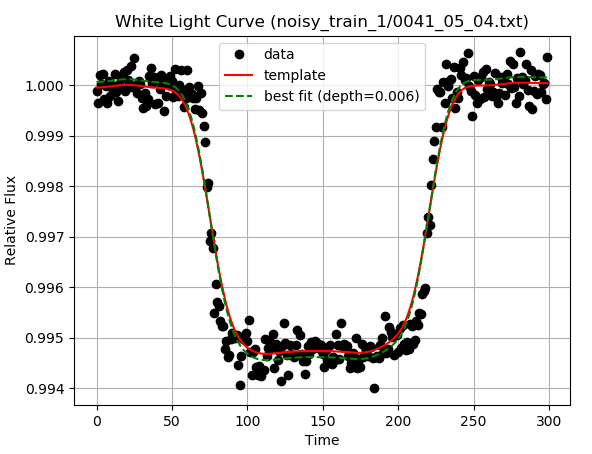

# Secret-AI-Project
This project was created of the [Ariel Data Challenge](https://ariel-datachallenge.azurewebsites.net/ML)

The Ariel Space mission is a European Space Agency mission to be launched in 2028. Ariel will observe the atmospheres of 1000 extrasolar planets - planets around other stars - to determine how they are made, how they evolve and how to put our own Solar System in the gallactic context.

## Task
Debiasing planetary radius measurements from star spots. For more information see the [about](https://ariel-datachallenge.azurewebsites.net/ML/documentation/about) page on the data challenge website (a log in may be required). 

## Procedure 
1. Create template from white light curve 
2. Estimate the transit spectrum
3. Debias the estimator with machine learning

## Creating a template from the white light curve
```python
import numpy as np
import matplotlib.pyplot as plt
from scipy.ndimage import gaussian_filter

data = np.loadtxt("noisy_test/0001_01_01.txt")
whitelight = data.mean(0)
swl = gaussian_filter(whitelight,10)
template = -1*(swl-swl.max())/(swl-swl.max()).min()
```

## Fitting the template to data 
```python
A = np.vstack([np.ones(swl.shape[0]), template]).T
bw, mw = np.linalg.lstsq(A, whitelight, rcond=None)[0]

plt.plot(whitelight,'ko',label='data')
plt.plot(swl,'r-', label='template')
plt.plot(mw*template +bw,'g--', label='best fit (depth={:.3f})'.format(mw))
plt.show()
```


After fitting the template to the white light we can apply the same technique to each spectral channel to get an estimate for the transmission spectrum 


Not every estimate will look as good as this. This particular example happened to have a large signal to noise. 

## Debiasing the estimator 
Machine learning can be leveraged to debias the depth estimate by finding correlations between the estimated transmission spectrum and the residuals of the template fits. 

Inputs:
- 2D Spectral time-series residuals
- 1D Transit spectrum estimate 

Optional inputs:
- 2D spectral time-series
- 1D white light curve
- 1D template light curve
- Stellar/Planetary parameters

Outputs:
- 1D transit spectrum

The neural network will be composed of multiple convolutional layers since each input vector has correlated features either through wavelength or time. After a few convolutions each branch of the neural network is piped into a fully connected layer with a multi data output representing hopefully, a debiased transmission spectrum. 


## Tasks for Ethan
- Find the optimal smoothing factor for the white light template
    - for each sample loop fit the spectral time-series with different smoothing factors, compute MSE between estimator and Truth, save the best smoothing factor
    - build a histogram of the best smoothing factors
    - (optional) is there a correlation between best smoothing factor and some other data metric (e.g. stdev, transit depth, transit duration?, etc)

